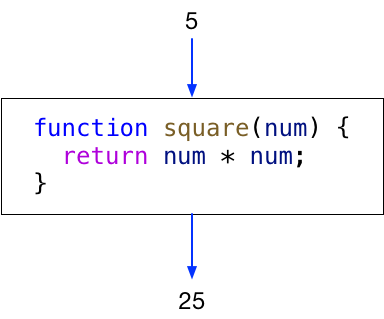
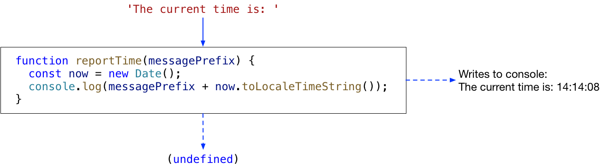

# JS1 Week 3

**_Start a recording!_**

## Review Homework

- Check VSCode settings
- Verify ESLint config

## History: Jim's entry into computing, 40 years ago (~ 1978)

Work:

- [IBM card punch](https://commons.wikimedia.org/wiki/File:IBM_card_punch_029.JPG)
- [Wikipedia: Computer programming in the punched card era](https://en.wikipedia.org/wiki/Computer_programming_in_the_punched_card_era)
- [FORTRAN listing](http://4.bp.blogspot.com/-59fHNDXj3sk/UsDu4ot3GNI/AAAAAAAAEN0/mZHfqfKuegY/s1600/fortran_printout.jpg)
- [IBM 370 Mainframe](https://commons.wikimedia.org/wiki/File:IBM_370-145_2.png#/media/File:IBM_370-145_2.png)
- [At Shell Laboratory, Amsterdam 1983](https://photos.app.goo.gl/kEbFfkW5LhW1iV2D7)

Hobby:

- [Jim's first scientific calculator](https://en.wikipedia.org/wiki/HP-35)
- [Jim's first computer](https://youtu.be/kSOCInQmZK8)
- [Wikipedia: SYM-1](https://en.wikipedia.org/wiki/SYM-1)

## Objects

You can define an object by using an **object literal**:

```js
// 1-object-literal.js

const person = {
  firstName: 'Maartje',
  lastName: 'Kruijt'
};

console.log(person); // --> { firstName: 'Maartje', lastName: 'Kruijt' }
```

You can construct an object by adding properties to a (potentially empty) object:

```js
// 2-add-properties.js

const person = {};
person.firstName = 'Maartje';
person.lastName = 'Kruijt';

console.log(person); // --> { firstName: 'Maartje', lastName: 'Kruijt' }
```

You can construct an object through a **constructor** function, in combination with the keyword `new`. _We will discuss this in detail in later JavaScript modules, but for now just be aware of this possibility as you may come across it in books and on the Internet._

```js
// 3-object-new.js

function Person(firstName, lastName) {
  this.firstName = firstName;
  this.lastName = lastName;
}

const person = new Person('Maartje', 'Kruijt');

console.log(person); // --> Person { firstName: 'Maartje', lastName: 'Kruijt' }
```

## Functions

Functions are _everywhere_ in JavaScript. A thorough understanding of functions is essential to becoming successful as a JavaScript developer.

### Function expressions vs function statements

Functions can be defined in two ways:

**1.** Assigning a **function expression** to a variable:

```js
// 1-square.js

const square = function (num) {
  return num * num;
};

console.log(square(5)); // --> 25
```

**2.** Directly, using a **function statement**:

```js
// 2-square.js

function square(num) {
  return num * num;
}

console.log(square(5)); // --> 25
```

Function statements are **hoisted**:

```js
// 3-square.js

console.log(square1(5)); // --> ReferenceError: square1 is not defined
console.log(square2(5)); // --> 25

const square1 = function (num) {
  return num * num;
};

function square2(num) {
  return num * num;
}
```

>_Oxford dictionary of English:_  
**hoist** | hɔɪst |  
verb [with object]  
raise (something) by means of ropes and pulleys: _a white flag was hoisted._

### Function arguments and return values

The function `square()` from above takes a number (5) as its **_argument_** and returns the mathematical square (25) as its **_return value_**.



### Pure functions

The function `square()` is said to be a **_pure function_**: a pure function always returns the same result when given the same parameters and does not cause any **_side effects_** (see later).

### Impure functions

The functions `pickSomeNumberBetweenZeroAnd()` and `square()` below are not pure functions; they are impure because the result of both functions is not solely dependent on the function's argument(s). However, they cause no side-effects.

```js
// 4-impure.js

function pickSomeNumberBetweenZeroAnd(num) {
  return Math.floor(Math.random() * num);
}

console.log(pickSomeNumberBetweenZeroAnd(25)); // --> ??
```

```js
// 5-impure.js

let num = 0;

function square() {
  return num * num;
}

num = 5;
console.log(square()); // --> 25
```
### Side effects

Functions that do not return a value are meant to cause **_side effects_**. (A function that does not return a value and does not cause any side effects has no impact at all on its environment and is therefore utterly useless.)

Function `reportTime()` below has the intended side effect of printing the current time on the console.

```js
// 6-side-effects.js

function reportTime(messagePrefix) {
  const now = new Date();
  console.log(messagePrefix + now.toLocaleTimeString());
}

reportTime('The current time is: '); // --> 'The current time is: 14:14:08'
```



Note that functions that do not explicitly `return` a value implicitly return the value `undefined`:

```js
const returnValue = reportTime('The current time is: ');
console.log(returnValue); // --> undefined
```

Some examples of **desired** side effects are:

- Reading from, and writing to a file.
- Making database queries.
- Rendering information to a web page.
- Making network requests to fetch or post information.
- Retrieving GPS coordinates from GPS hardware.
- Controlling the movement of a robot.
- etc.

#### Side effects to be avoided

The function `square` below assigns its result to an external variable, rather then returning it. This is a side effect and is to be avoided. A pure function implementation should always be preferred over one that uses avoidable side effects.

```js
// 7-side-effects.js

let result = 0;

function square(num) {
  result = num * num;
}

square(5);
console.log(result); // --> 25
```

And **don't** do this at any time – impure _and_ with side effects:

```js
// 8-side-effects.js

let num = 0;
let result = 0;

function square() {
  result = num * num;
}

num = 5;
square();
console.log(result); // --> 25
```

### Positional parameters

The first **argument** in the **function call** is assigned to the first **parameter** in the **function definition**, etc. You can not arbitrarily swap their positions.

```js
// 9-positional-params.js

function divide(dividend, divisor) {
  return dividend / divisor;
}

console.log(divide(6, 3)); // --> 2
console.log(divide(3, 6)); // --> 0.5
```

### Optional parameters

When calling a function with fewer arguments than listed in the function definition those arguments will take the value `undefined`. If a function is designed to allow for this situation then we say that the function accepts optional parameters. These optional parameters must always come after any required parameters.

```js
// 10-optional-params.js

function fullName(firstName, lastName) {
  let result = firstName;
  if (lastName !== undefined) {
    result += ' ' + lastName;
  }
  return result;
}

console.log(fullName('Maartje', 'Kruijt')); // --> Maartje Kruijt
console.log(fullName('Sukarno'));           // --> Sukarno
```

### Functions as arguments

The values supplied as arguments to functions can be any type of expression, including function expressions. In the example below, we supply two different versions of a 'reporter' function to `reportTime()`. This function does not need to know how the 'reporting' is done.

```js
// 11-function-params.js

function reportTime(reporter) {
  const now = new Date();
  reporter('The current time is: ' + now.toLocaleTimeString());
}

function writeToLog(message) {
  console.log(message);
}

function writeAllCapsToLog(message) {
  console.log(message.toUpperCase());
}

reportTime(writeToLog);        // --> 'The current time is: 14:14:08'
reportTime(writeAllCapsToLog); // --> THE CURRENT TIME IS: 14:14:08'
```

**Question**: What would happen if we did this?

```js
reportTime(writeToLog()); // --> ??
```

We can provide a function expression directly in the function call:

```js
// 12-named-function-param.js

function reportTime(reporter) {
  const now = new Date();
  reporter('The current time is: ' + now.toLocaleTimeString());
}

reportTime(function writeToLog(message) {
  console.log(message); // --> 'The current time is: 14:14:08'
});
```

Since we are no longer referencing the `writeToLog()` function by name, we can leave out the name. The passed function is now an **anonymous** function (literally, a function without a name):

```js
// 13-anonymous-function-param.js

function reportTime(reporter) {
  const now = new Date();
  reporter('The current time is: ' + now.toLocaleTimeString());
}

reportTime(function (message) {
  console.log(message); // --> 'The current time is: 14:14:08'
});
```

By the way, since `console.log` is a standard function that prints out its arguments to the console, the previous code could be simplified to:

```js
// 14-console-log-params.js

function reportTime(reporter) {
  const now = new Date();
  reporter('The current time is: ' + now.toLocaleTimeString());
}

reportTime(console.log); // --> 'The current time is: 14:14:08'
```

### Returning a function

The return value of a function can be any expression, including a function expression. This is often done to take advantage of **_closures_**. Closures will be covered in a later JavaScript module. But here is an example.

```js
// 15-returned-function.js

function makeGreeting(prefix) {
  return function greeting(thingOrPerson) {
    return prefix + ', ' + thingOrPerson + '!';
  };
}

const hello = makeGreeting('Hello');
const goodAfternoon = makeGreeting('Good afternoon');

console.log(hello('students'));        // --> Hello, students!
console.log(goodAfternoon('teacher')); // --> Good afternoon, teacher!
```

### Function reusability

A simple definition: functions are reusable if you can copy them from one file to another and use them without modification.

Example: `16-deal-cards.js`.

## Scope

Lecture text: [HackYourFuture/fundamentals](https://github.com/HackYourFuture/fundamentals/blob/master/fundamentals/scope.md)

Example: `scope/index.html`